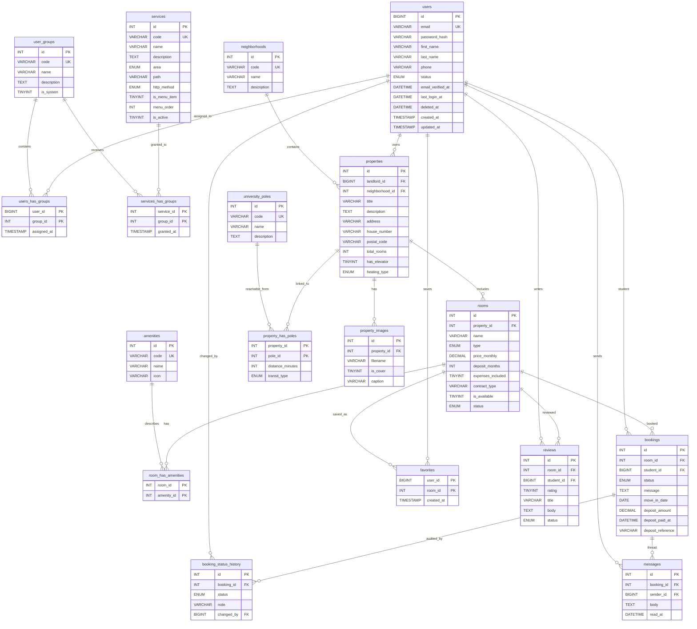

# MasterRent - Diagramma Entita/Relazione

Schema verificato contro gli script SQL correnti delle branch `phase1` e
`phase2`. La Fase 1 usa il database `masterrent`; la Fase 2 usa `uniaffitti`.
La struttura applicativa corrente e' allineata su 18 tabelle.


## Elenco tabelle

| # | Tabella | Ruolo |
| --- | --- | --- |
| 1 | `users` | Account applicativi, dati anagrafici, stato e soft-delete |
| 2 | `user_groups` | Gruppi/ruoli logici (`admin`, `landlord`, `student`) |
| 3 | `services` | Catalogo dei servizi/rotte autorizzabili |
| 4 | `users_has_groups` | Giunzione molti-a-molti tra utenti e gruppi |
| 5 | `services_has_groups` | Giunzione molti-a-molti tra servizi e gruppi |
| 6 | `neighborhoods` | Quartieri e macrozone de L'Aquila |
| 7 | `university_poles` | Poli universitari e sedi didattiche |
| 8 | `properties` | Immobili pubblicati dai proprietari |
| 9 | `rooms` | Stanze/posti letto o unita' affittabili |
| 10 | `amenities` | Accessori disponibili nelle stanze |
| 11 | `room_has_amenities` | Giunzione stanze-accessori |
| 12 | `property_has_poles` | Distanze tra immobili e poli universitari |
| 13 | `property_images` | Immagini degli annunci e copertina |
| 14 | `bookings` | Richieste visita, caparra simulata e stato prenotazione |
| 15 | `booking_status_history` | Storico/audit delle transizioni di stato |
| 16 | `messages` | Thread messaggi collegato alla prenotazione |
| 17 | `favorites` | Preferiti degli studenti |
| 18 | `reviews` | Recensioni pubblicate/nascoste dopo rapporto concluso |

## Diagramma Mermaid



## Note sulle relazioni principali

- Un utente puo' appartenere a piu' gruppi tramite `users_has_groups`.
- Un servizio puo' essere concesso a piu' gruppi tramite
  `services_has_groups`.
- Un proprietario (`users`) possiede uno o piu' immobili (`properties`).
- Un immobile appartiene a un quartiere e contiene una o piu' stanze.
- Una stanza puo' avere piu' accessori tramite `room_has_amenities`.
- Un immobile puo' essere associato a piu' poli universitari con minuti e tipo
  di transito in `property_has_poles`.
- Una stanza puo' avere richieste/prenotazioni, preferiti e recensioni.
- Ogni prenotazione ha un thread messaggi e uno storico stati.

## Modello users-groups-services

Il requisito del corso e' soddisfatto usando un modello a permessi espliciti:
gli utenti non sono autorizzati da un singolo campo `role`, ma da gruppi e
servizi. In PHP la verifica avviene con `require_service()`.

Tabelle coinvolte:

- `users`
- `user_groups`
- `services`
- `users_has_groups`
- `services_has_groups`

## Note sul flusso engagement

- `bookings`: conserva richiesta, stato, caparra simulata e riferimenti della
  prenotazione.
- `booking_status_history`: registra le transizioni di stato e l'utente che le
  ha prodotte, quando disponibile.
- `messages`: collega messaggi al singolo booking.
- `favorites`: salva preferiti per coppia utente-stanza.
- `reviews`: permette recensioni da studenti con rapporto concluso, con stato
  `published` o `hidden`.

Nota da verificare: il codice applicativo corrente contiene riferimenti a
`bookings.refund_amount` nel flusso di restituzione caparra, ma gli script SQL
verificati non definiscono tale colonna. Il diagramma ER riflette lo schema SQL,
quindi non include `refund_amount`.

Stati booking verificati nello SQL: `visit_requested`,
`approved_pending_deposit`, `rejected`, `deposit_paid`,
`cancellation_requested`, `completed`, `withdrawn`.

Stati stanza verificati nello SQL: `available`, `reserved`, `unavailable`.

## Generazione immagini

Il file Mermaid puro e' [`ER_DIAGRAM.mmd`](ER_DIAGRAM.mmd). Le immagini sono
generate con:

```powershell
npx -y @mermaid-js/mermaid-cli -i docs/ER_DIAGRAM.mmd -o docs/ER_DIAGRAM.svg
npx -y @mermaid-js/mermaid-cli -i docs/ER_DIAGRAM.mmd -o docs/ER_DIAGRAM.png
```
