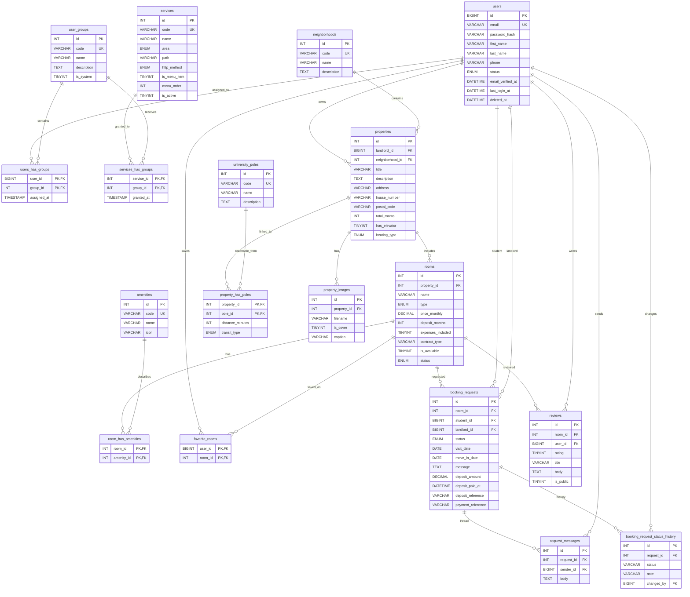

# MasteRent - Diagramma Entita/Relazione - Fase 1

Schema del database `masterrent`. Il diagramma copre le 17 tabelle SQL della
Fase 1 e il modello obbligatorio `users - groups - services`.

```mermaid
erDiagram
    users {
        BIGINT id PK
        VARCHAR email UK
        VARCHAR password_hash
        VARCHAR first_name
        VARCHAR last_name
        VARCHAR phone
        ENUM status
        DATETIME email_verified_at
        DATETIME last_login_at
        DATETIME deleted_at
    }

    user_groups {
        INT id PK
        VARCHAR code UK
        VARCHAR name
        TEXT description
        TINYINT is_system
    }

    services {
        INT id PK
        VARCHAR code UK
        VARCHAR name
        ENUM area
        VARCHAR path
        ENUM http_method
        TINYINT is_menu_item
        INT menu_order
        TINYINT is_active
    }

    users_has_groups {
        BIGINT user_id PK,FK
        INT group_id PK,FK
        TIMESTAMP assigned_at
    }

    services_has_groups {
        INT service_id PK,FK
        INT group_id PK,FK
        TIMESTAMP granted_at
    }

    neighborhoods {
        INT id PK
        VARCHAR code UK
        VARCHAR name
        TEXT description
    }

    university_poles {
        INT id PK
        VARCHAR code UK
        VARCHAR name
        TEXT description
    }

    properties {
        INT id PK
        BIGINT landlord_id FK
        INT neighborhood_id FK
        VARCHAR title
        TEXT description
        VARCHAR address
        VARCHAR house_number
        VARCHAR postal_code
        INT total_rooms
        TINYINT has_elevator
        ENUM heating_type
    }

    rooms {
        INT id PK
        INT property_id FK
        VARCHAR name
        ENUM type
        DECIMAL price_monthly
        INT deposit_months
        TINYINT expenses_included
        VARCHAR contract_type
        TINYINT is_available
        ENUM status
    }

    amenities {
        INT id PK
        VARCHAR code UK
        VARCHAR name
        VARCHAR icon
    }

    room_has_amenities {
        INT room_id PK,FK
        INT amenity_id PK,FK
    }

    property_has_poles {
        INT property_id PK,FK
        INT pole_id PK,FK
        INT distance_minutes
        ENUM transit_type
    }

    property_images {
        INT id PK
        INT property_id FK
        VARCHAR filename
        TINYINT is_cover
        VARCHAR caption
    }

    favorite_rooms {
        BIGINT user_id PK,FK
        INT room_id PK,FK
    }

    booking_requests {
        INT id PK
        INT room_id FK
        BIGINT student_id FK
        BIGINT landlord_id FK
        ENUM status
        DATE visit_date
        DATE move_in_date
        TEXT message
        DECIMAL deposit_amount
        DATETIME deposit_paid_at
        VARCHAR deposit_reference
        VARCHAR payment_reference
    }

    booking_request_status_history {
        INT id PK
        INT request_id FK
        VARCHAR status
        VARCHAR note
        BIGINT changed_by FK
    }

    request_messages {
        INT id PK
        INT request_id FK
        BIGINT sender_id FK
        TEXT body
    }

    reviews {
        INT id PK
        INT room_id FK
        BIGINT user_id FK
        TINYINT rating
        VARCHAR title
        TEXT body
        TINYINT is_public
    }

    users ||--o{ users_has_groups : assigned_to
    user_groups ||--o{ users_has_groups : contains
    services ||--o{ services_has_groups : granted_to
    user_groups ||--o{ services_has_groups : receives
    users ||--o{ properties : owns
    neighborhoods ||--o{ properties : contains
    properties ||--o{ rooms : includes
    rooms ||--o{ room_has_amenities : has
    amenities ||--o{ room_has_amenities : describes
    properties ||--o{ property_has_poles : linked_to
    university_poles ||--o{ property_has_poles : reachable_from
    properties ||--o{ property_images : has
    users ||--o{ favorite_rooms : saves
    rooms ||--o{ favorite_rooms : saved_as
    rooms ||--o{ booking_requests : requested
    users ||--o{ booking_requests : student
    users ||--o{ booking_requests : landlord
    booking_requests ||--o{ request_messages : thread
    booking_requests ||--o{ booking_request_status_history : history
    users ||--o{ booking_request_status_history : changes
    users ||--o{ request_messages : sends
    rooms ||--o{ reviews : reviewed
    users ||--o{ reviews : writes
```
